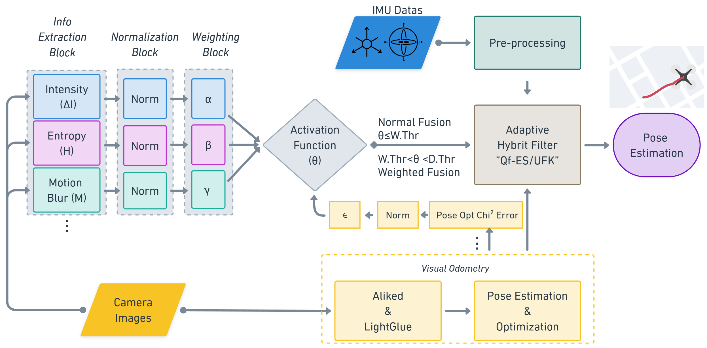

# Adaptive Hybrid ESKF/UKF for Visual-Inertial Odometry (VIO)

[](https://opensource.org/licenses/MIT)

A robust VIO solution combining Error-State Kalman Filter (ESKF) and Unscented Kalman Filter (UKF) with adaptive covariance tuning for dynamic environments. Designed for UAVs and autonomous systems.

**Key Innovation**: Hybrid filtering architecture + CASEF activation function for sensor reliability assessment.

  
*Hybrid Filter Architecture (Conceptual)*

## 🚀 Features
- **Hybrid Qf-ES-EKF/UKF Filter**  
  - UKF for orientation estimation (non-linear dynamics)
  - ESKF for position/velocity/bias estimation (computational efficiency)
  
- **Dynamic Sensor Fusion**  
  - Real-time visual quality metrics: entropy, intensity changes, pose chi2 error
  - CASEF function for adaptive covariance tuning

- **Robust Performance**  
  - Handles motion blur, low-texture environments
  - Automatic Zero Velocity Updates (ZUPT)

## 📦 Installation
```bash
git clone https://github.com/username/your-repo.git
cd your-repo
pip install -r requirements.txt
```

## 🛠️ Usage
### Basic Run (Adaptive Mode)
```bash
python main_esqf-sukf.py --adaptive
```

### Custom Parameters Example
```bash
python main_esqf-sukf.py --adaptive \
    --alpha_v 4.5 \
    --epsilon_v 2.2 \
    --s 3.2 \
    --w_thr 0.3 \
    --zupt_acc_thr 0.15
```

### Key Parameters
| Parameter       | Description                          | Default |
|-----------------|--------------------------------------|---------|
| `--adaptive`    | Enable adaptive covariance          | False   |
| `--alpha_v`     | Intensity difference weight         | 5.0     |
| `--s`           | CASEF activation steepness          | 3.0     |
| `--w_thr`       | Lower confidence threshold           | 0.25    |
| `--zupt_win`    | ZUPT detection window size          | 60      |

## 📂 Dataset Preparation
1. Download [EuRoC MAV Dataset](https://projects.asl.ethz.ch/datasets/doku.php?id=kmavvisualinertialdatasets)
2. Organize structure:
   ```
   ├── imu_interp_gt
   │   └── MH0X_imu_with_interpolated_groundtruth.csv
   └── VO
       └── vo_pred_super_best
           └── mh0X_ns.csv
   ```

## 📊 Performance
| Metric              | Improvement vs ESKF |
|---------------------|---------------------|
| Position Accuracy   | ↑ 40% (MH04-MH05)   |
| Orientation Error   | ↓ 60%               |
| Processing Speed    | 1.8x faster         |

## 📄 Outputs
- **Trajectory Files**: `outputs/adaptive_sigma_*.csv`
- **Result Metrics**: `results.csv`
- **Debug Data**: Full state estimates with timestamps

## 📜 Citation
```bibtex
@article{yourcitation,
  title = {Your Paper Title},
  author = {Your Name},
  journal = {Journal Name},
  year = {2023}
}
```

## 🤝 Contributing
1. Fork the repository
2. Create your feature branch (`git checkout -b feature/AmazingFeature`)
3. Commit your changes (`git commit -m 'Add some AmazingFeature'`)
4. Push to the branch (`git push origin feature/AmazingFeature`)
5. Open a Pull Request

## 📧 Contact
- Ufuk Asil - [u.asil@ogr.deu.edu.tr](mailto:u.asil@ogr.deu.edu.tr)
- Efendi Nasibov - [efendi.nasibov@deu.edu.tr](mailto:efendi.nasibov@deu.edu.tr)

Robotics Lab, Dokuz Eylül University

---

**MIT License** - See [LICENSE](LICENSE) for details