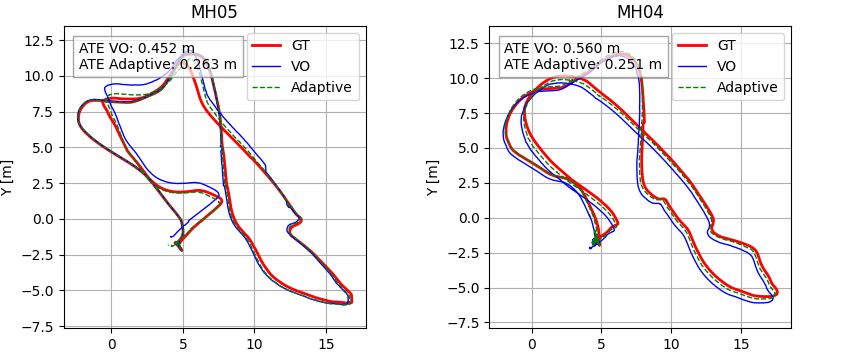

# Loosely Coupled Adaptive Hybrid ESKF/UKF for Visual-Inertial Odometry (VIO)

[](https://opensource.org/licenses/MIT)

A robust VIO solution combining Error-State Kalman Filter (ESKF) and Unscented Kalman Filter (UKF) with adaptive covariance tuning for dynamic environments. Designed for UAVs and autonomous systems.

**Key Innovation**: Hybrid filtering architecture + CASEF activation function for sensor reliability assessment.

  
*Hybrid Filter Architecture (Conceptual)*

## 🚀 Features
- **Hybrid Qf-ES-EKF/UKF Filter**  
  - UKF for orientation estimation (non-linear dynamics)
  - ESKF for position/velocity/bias estimation (computational efficiency)
  
- **Dynamic Sensor Fusion**  
  - Real-time visual quality metrics: entropy, intensity changes, Culled keyframes, pose chi2 error
  - CASEF function for adaptive covariance tuning

- **Robust Performance**  
  - Handles low-texture environments and light changes
  - Automatic Zero Velocity Updates (ZUPT)

## 📦 Installation
```bash
git clone https://github.com/ufukasia/Ufuk-ASIL-prepaper-code.git
cd Ufuk-ASIL-prepaper-code
pip install -r requirements.txt
```

## 🛠️ Usage
### Basic Run (Adaptive Mode)
```bash
python main_qf-es-ekf-ukf.py --adaptive
```


*Example result of adaptive mode*

### Basic Run (Non-Adaptive Mode)
```bash
python main_qf-es-ekf-ukf.py
```

### Custom Parameters Example
```bash
python main_qf-es-ekf-ukf.py --adaptive \
    --alpha_v 2.5 \
    --epsilon_v 2.9 \
    --zeta_H 2.9 \
    --zeta_L 0 \
    --beta_p 1 \
    --epsilon_p 1 \
    --zeta_p 1 \
    --entropy_norm_min 0 \
    --pose_chi2_norm_min 0.0135 \
    --culled_norm_min 0.3892 \
    --w_thr 0.15 \
    --d_thr 1 \
    --s 1 \
    --zupt_acc_thr 0.1 \
    --zupt_gyro_thr 0.1 \
    --zupt_win 60
```

### Key Parameters
| Parameter                | Description                                         | Default   |
|--------------------------|-----------------------------------------------------|-----------|
| `--adaptive`             | Enable adaptive covariance                          | False     |
| `--alpha_v`              | Weight for intensity difference (sigma_v)           | 2.5379    |
| `--epsilon_v`            | Weight for pose_chi2 difference (sigma_v)           | 2.9190    |
| `--zeta_H`               | Weight for increasing culled_keyframes (sigma_v)    | 2.9190    |
| `--zeta_L`               | Weight for decreasing culled_keyframes (sigma_v)    | 0         |
| `--beta_p`               | Weight for inv_entropy (sigma_p)                    | 1         |
| `--epsilon_p`            | Weight for pose_chi2 (sigma_p)                      | 1         |
| `--zeta_p`               | Weight for culled_keyframes (sigma_p)               | 1         |
| `--entropy_norm_min`     | Min value for entropy normalization (sigma_p)       | 0         |
| `--pose_chi2_norm_min`   | Min value for pose chi2 normalization (sigma_p)     | 0.0135    |
| `--culled_norm_min`      | Min value for culled keyframes normalization        | 0.3892    |
| `--w_thr`                | Image confidence threshold                          | 0.15      |
| `--d_thr`                | Image confidence d_thr parameter                    | 1         |
| `--s`                    | CASEF activation function steepness                 | 1         |
| `--zupt_acc_thr`         | Acceleration std threshold for ZUPT [m/s²]          | 0.1       |
| `--zupt_gyro_thr`        | Gyroscope std threshold for ZUPT [rad/s]            | 0.1       |
| `--zupt_win`             | Window size for ZUPT (number of samples)            | 60        |

## 📂 VO Preparation
1. Download [EuRoC MAV Dataset](https://projects.asl.ethz.ch/datasets/doku.php?id=kmavvisualinertialdatasets)
2. VO code [Pyslam](https://github.com/luigifreda/pyslam)
2. Organize structure:
   ```
   ├── imu_interp_gt
   │   └── MH0X_imu_with_interpolated_groundtruth.csv
   └── VO
       └── vo_pred_super_best
           └── mh0X_ns.csv
   ```

## 📊 Performance
| Metric              | Qf-ES-EKF/UKF vs ESKF   |
|---------------------|-------------------------|
| Position Accuracy   | ↑ 40% (MH04-MH05)       |
| Orientation Error   | ↓ 60%                   |
| Processing Speed    | 1.8x faster  from SUKF  |

## 📄 Outputs
- **Trajectory Files**: `outputs/adaptive_sigma_*.csv`
- **Result Metrics**: `results.csv`

## 📧 Contact
- Ufuk Asil - [u.asil@ogr.deu.edu.tr](mailto:u.asil@ogr.deu.edu.tr)
- Efendi Nasibov - [efendi.nasibov@deu.edu.tr](mailto:efendi.nasibov@deu.edu.tr)

Computer Science, Dokuz Eylül University

**MIT License** - See [LICENSE](LICENSE) for details