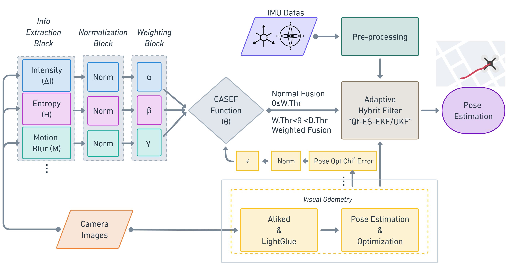
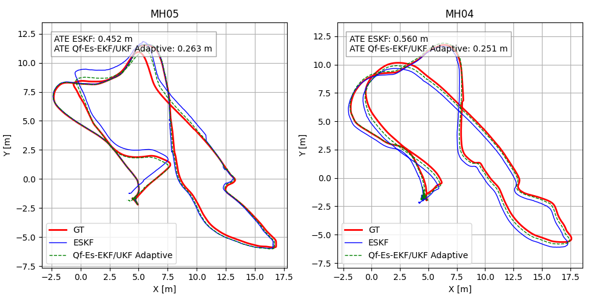

Elbette, README dosyanız için BibTeX formatında bir alıntı bölümü aşağıda oluşturulmuştur. Bu bölüm, projenizin akademik bağlamını güçlendirir ve başkalarının çalışmanızı doğru bir şekilde referans göstermesini sağlar.

Yeni bölümü, "İletişim" (Contact) başlığından hemen önce ekleyerek mevcut yapıyı korudum.

---

# Loosely Coupled Adaptive Hybrid ESKF/UKF for Visual-Inertial Odometry (VIO)

[](https://opensource.org/licenses/MIT)

A robust VIO solution combining Error-State Kalman Filter (ESKF) and Unscented Kalman Filter (UKF) with adaptive covariance tuning for dynamic environments. Designed for UAVs and autonomous systems.

**Key Innovation**: Hybrid filtering architecture + CASEF activation function for sensor reliability assessment.

  
*Hybrid Filter Architecture (Conceptual)*

## 🚀 Features
- **Hybrid Qf-ES-EKF/UKF Filter**  
  - UKF for orientation estimation (non-linear dynamics)
  - ESKF for position/velocity/bias estimation (computational efficiency)
  
- **Dynamic Sensor Fusion**  
  - Real-time visual quality metrics: entropy, intensity changes, Culled keyframes, pose chi2 error
  - CASEF function for adaptive covariance tuning

- **Robust Performance**  
  - Handles low-texture environments and light changes
  - Automatic Zero Velocity Updates (ZUPT)

## 📦 Installation
```bash
git clone https://github.com/ufukasia/Ufuk-ASIL-prepaper-code.git
cd Ufuk-ASIL-prepaper-code
pip install -r requirements.txt
```

## 🛠️ Usage
### Basic Run (Adaptive Mode)
```bash
python main_qf-es-ekf-ukf.py --adaptive
```


*Example result of adaptive mode*

### Basic Run (Non-Adaptive Mode)
```bash
python main_qf-es-ekf-ukf.py
```

### Custom Parameters Example
```bash
python main_qf-es-ekf-ukf.py --adaptive \
    --alpha_v 2.5 \
    --epsilon_v 2.9 \
    --zeta_H 2.9 \
    --zeta_L 0 \
    --beta_p 1 \
    --epsilon_p 1 \
    --zeta_p 1 \
    --entropy_norm_min 0 \
    --pose_chi2_norm_min 0.0135 \
    --culled_norm_min 0.3892 \
    --w_thr 0.15 \
    --d_thr 1 \
    --s 1 \
    --zupt_acc_thr 0.1 \
    --zupt_gyro_thr 0.1 \
    --zupt_win 60
```

### Key Parameters
| Parameter                | Description                                         | Default   |
|--------------------------|-----------------------------------------------------|-----------|
| `--adaptive`             | Enable adaptive covariance                          | False     |
| `--alpha_v`              | Weight for intensity difference (sigma_v)           | 2.5379    |
| `--epsilon_v`            | Weight for pose_chi2 difference (sigma_v)           | 2.9190    |
| `--zeta_H`               | Weight for increasing culled_keyframes (sigma_v)    | 2.9190    |
| `--zeta_L`               | Weight for decreasing culled_keyframes (sigma_v)    | 0         |
| `--beta_p`               | Weight for inv_entropy (sigma_p)                    | 1         |
| `--epsilon_p`            | Weight for pose_chi2 (sigma_p)                      | 1         |
| `--zeta_p`               | Weight for culled_keyframes (sigma_p)               | 1         |
| `--entropy_norm_min`     | Min value for entropy normalization (sigma_p)       | 0         |
| `--pose_chi2_norm_min`   | Min value for pose chi2 normalization (sigma_p)     | 0.0135    |
| `--culled_norm_min`      | Min value for culled keyframes normalization        | 0.3892    |
| `--w_thr`                | Image confidence threshold                          | 0.15      |
| `--d_thr`                | Image confidence d_thr parameter                    | 1         |
| `--s`                    | CASEF activation function steepness                 | 1         |
| `--zupt_acc_thr`         | Acceleration std threshold for ZUPT [m/s²]          | 0.1       |
| `--zupt_gyro_thr`        | Gyroscope std threshold for ZUPT [rad/s]            | 0.1       |
| `--zupt_win`             | Window size for ZUPT (number of samples)            | 60        |

## 📂 VO Preparation
1. Download [EuRoC MAV Dataset](https://projects.asl.ethz.ch/datasets/doku.php?id=kmavvisualinertialdatasets)
2. VO code [Pyslam](https://github.com/luigifreda/pyslam)
2. Organize structure:
   ```
   ├── imu_interp_gt
   │   └── MH0X_imu_with_interpolated_groundtruth.csv
   └── VO
       └── vo_pred_super_best
           └── mh0X_ns.csv
   ```

## 📊 Performance
| Metric              | Qf-ES-EKF/UKF vs ESKF   |
|---------------------|-------------------------|
| Position Accuracy   | ↑ 40% (MH04-MH05)       |
| Orientation Error   | ↓ 60%                   |
| Processing Speed    | 1.8x faster  from SUKF  |

## 📄 Outputs
- **Trajectory Files**: `outputs/adaptive_sigma_*.csv`
- **Result Metrics**: `results.csv`

## 📜 Citation
If you use this work in your research, please consider citing the following paper:
```bibtex
@article{Asil2025,
  author    = {Asil, Ufuk and Nasibov, Efendi},
  year      = {2025},
  month     = {08},
  title     = {Adaptive Covariance and Quaternion-Focused Hybrid Error-State EKF/UKF for Visual-Inertial Odometry},
  journal   = {International Journal of Computational Intelligence Systems},
  volume    = {18},
  number    = {1},
  pages     = {206},
  issn      = {1875-6883},
  doi       = {10.1007/s44196-025-00942-0},
  url       = {https://doi.org/10.1007/s44196-025-00942-0},
  abstract  = {This study presents an innovative hybrid Visual-Inertial Odometry (VIO) method for Unmanned Aerial Vehicles (UAVs) that is resilient to environmental challenges and capable of dynamically assessing sensor reliability. Built upon a loosely coupled sensor fusion architecture, the system utilizes a novel hybrid Quaternion-focused Error-State EKF/UKF (Qf-ES-EKF/UKF) architecture to process inertial measurement unit (IMU) data. This architecture first propagates the entire state using an Error-State Extended Kalman Filter (ESKF) and then applies a targeted Scaled Unscented Kalman Filter (SUKF) step to refine only the orientation. This sequential process blends the accuracy of SUKF in quaternion estimation with the overall computational efficiency of ESKF. The reliability of visual measurements is assessed via a dynamic sensor confidence score based on metrics, such as image entropy, intensity variation, motion blur, and inference quality, adapting the measurement noise covariance to ensure stable pose estimation even under challenging conditions. Comprehensive experimental analyses on the EuRoC MAV dataset demonstrate key advantages: an average improvement of 49% in position accuracy in challenging scenarios, an average of 57% in rotation accuracy over ESKF-based methods, and SUKF-comparable accuracy achieved with approximately 48% lower computational cost than a full SUKF implementation. These findings demonstrate that the presented approach strikes an effective balance between computational efficiency and estimation accuracy, and significantly enhances UAV pose estimation performance in complex environments with varying sensor reliability.}
}
```

## 📧 Contact
- Ufuk Asil - [u.asil@ogr.deu.edu.tr](mailto:u.asil@ogr.deu.edu.tr)
- Efendi Nasibov - [efendi.nasibov@deu.edu.tr](mailto:efendi.nasibov@deu.edu.tr)

Computer Science, Dokuz Eylül University

**MIT License** - See [LICENSE](LICENSE) for details
